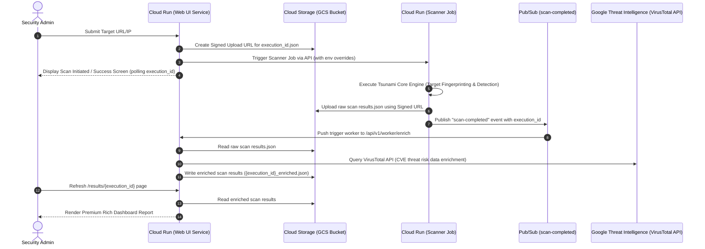

# Tsunami


Tsunami is a general purpose network security scanner with an extensible plugin
system for detecting high severity vulnerabilities with high confidence.

To learn more about Tsunami, visit our
[documentation](https://google.github.io/tsunami-security-scanner/).

Tsunami relies heavily on its plugin system to provide basic scanning
capabilities. All publicly available Tsunami plugins are hosted in a separate
[google/tsunami-security-scanner-plugins](https://github.com/google/tsunami-security-scanner-plugins)
repository.

## Quick start

Please see the documentation on how to
[build and run Tsunami](https://google.github.io/tsunami-security-scanner/howto/howto)

## GCP Cloud Deployment & Architecture Guide

> [!TIP]
> **Deploying inside Google Argolis?** Please see our dedicated [GCP Argolis Deployment & Testing Guide](ARGOLIS_TESTING.md) to navigate corporate organization policies, domain-restricted ingress, and VPC internal scan setup.

Deploy the Tsunami Security Scanner with the "Stitch" Web UI to Google Cloud Platform (GCP) using Terraform, Google Cloud Run, and Google Cloud Storage.

### 🏗️ Architecture Overview

The Tsunami Security Scanner Cloud Platform uses a modern, scalable, and asynchronous cloud-native design:



1. **FastAPI Orchestrator (Cloud Run Service)**: Renders the interactive web portal, validates targets, creates GCS signed upload URLs, triggers Tsunami runs via Cloud Run Jobs, and enriches vulnerabilities with real-time threat intelligence.
2. **Tsunami Core Scanner (Cloud Run Job)**: An on-demand serverless scan engine that fingerprints the target, runs active plugins, writes JSON findings, and uploads them directly back to GCS via the signed URL.
3. **Cloud Storage Asynchronous Message Buffer**: Used for decoupling services and sharing raw and enriched scan result JSON payloads.
4. **Pub/Sub Scan Completion Loop**: Automatically pushes notifications of completed scans back to the Web UI's enrichment worker `/api/v1/worker/enrich` for threat-enrichment.

---

### 🔑 Required Credentials & API Keys

Deploying and executing this application successfully requires the following API keys and Identity permissions:

#### 1. Google Threat Intelligence (VirusTotal) API Key
* **Purpose**: Used by the Web UI to perform CVE threat analysis, risk scoring, and vulnerability data enrichment.
* **Provisioning**:
  1. Sign up or log in to [VirusTotal](https://www.virustotal.com/).
  2. Navigate to [VirusTotal API Settings](https://www.virustotal.com/gui/user/apikey).
  3. Copy your Personal API Request Key.
* **Usage**: Input during the interactive `./setup.sh` prompt. Terraform configures this as the `VT_API_KEY` environment variable in the Web UI Cloud Run Service.

#### 2. GCP Identity & Access Management (IAM) Service Accounts
The Terraform configuration automatically provisions three micro-segmented service accounts to ensure the Principle of Least Privilege:

| Service Account ID | Display Name | Principal Permissions | Purpose |
| :--- | :--- | :--- | :--- |
| `tsunami-scanner-sa` | Tsunami Scanner SA | `roles/storage.objectAdmin` (write-only to findings bucket)<br>`roles/pubsub.publisher` (on scan completed topic) | Executed by Cloud Run Jobs to upload raw findings JSON to GCS and publish scan completion events. |
| `tsunami-web-ui-sa` | Tsunami Web UI SA | `roles/storage.objectAdmin` (read-only raw results, write enriched results)<br>`roles/run.developer` (trigger job runs)<br>`roles/iam.serviceAccountTokenCreator` (create GCS Signed URLs) | Executed by the Web UI to sign URLs, start scanner jobs, read results, and write back threat-intelligence enriched findings. |
| `tsunami-pubsub-sa` | Tsunami PubSub SA | `roles/run.invoker` (invoke Web UI endpoint) | Used as a push-subscriber identity by Cloud Pub/Sub to securely trigger the Web UI worker enrichment route. |

---

### 🚀 Step-by-Step Deployment Guide

Ensure you have installed `terraform`, `gcloud`, and `docker` locally. Run `gcloud auth login` and `gcloud auth application-default login` before starting.

#### Step 1: Automated Setup & Infrastructure Deployment
An interactive setup script is provided to automate Google Cloud provider configuration:
```bash
# Make sure the setup script is executable and run it
chmod +x setup.sh
./setup.sh
```
**Prompts & Parameters:**
* **Google Cloud Project ID**: The unique ID of your target GCP project.
* **Target Region**: Select your preferred region (default: `us-central1`).
* **GTI / VirusTotal API Key**: Provide your threat intelligence key.

*Note: The script automatically exports these values as `TF_VAR_*` variables and invokes `terraform init` and `terraform apply` to provision all required GCP APIs, repositories, buckets, Pub/Sub topics, and Cloud Run configurations.*

#### Step 2: Build & Push Container Images
Once Terraform is deployed, compile the Java fat jars, Python plugin server protos, and package the Docker containers to push to Artifact Registry:

**1. Authenticate Docker with Artifact Registry**
Replace `YOUR_PROJECT_ID` and `YOUR_REGION` with your deployment values:
```bash
gcloud auth configure-docker YOUR_REGION-docker.pkg.dev
```

**2. Build and Push the Scanner Engine Job Image**
```bash
# Build and push the Tsunami Core Scanner container
docker build -t YOUR_REGION-docker.pkg.dev/YOUR_PROJECT_ID/tsunami-repo/tsunami-scanner:latest -f cloud.Dockerfile .
docker push YOUR_REGION-docker.pkg.dev/YOUR_PROJECT_ID/tsunami-repo/tsunami-scanner:latest
```

**3. Build and Push the Web UI Service Image**
```bash
# Navigate to the web UI folder, build, and push the FastAPI service
cd web_ui
docker build -t YOUR_REGION-docker.pkg.dev/YOUR_PROJECT_ID/tsunami-repo/tsunami-web-ui:latest .
docker push YOUR_REGION-docker.pkg.dev/YOUR_PROJECT_ID/tsunami-repo/tsunami-web-ui:latest
```

---

### 🧪 Testing the Application

You can verify the scanner's capabilities both locally (mock mode) and in your live Google Cloud Platform environment.

#### Option A: Local Verification (Mock Mode)
To test the entire UI orchestration, signed URL requests, and enrichment worker cycles without creating actual GCP infrastructure bills, use `LOCAL_MODE`:

1. **Configure and Start Web UI Locally**:
   ```bash
   cd web_ui
   # Create virtual environment and install dependencies
   python3 -m venv venv
   source venv/bin/activate
   pip install -r requirements.txt
   
   # Run FastAPI in Local Mock mode
   export LOCAL_MODE="true"
   export PROJECT_ID="mock-project"
   export SCANNER_JOB_NAME="mock-scanner"
   export GCS_BUCKET="mock-bucket"
   export VT_API_KEY="mock-key"
   
   uvicorn main:app --host 127.0.0.1 --port 8080 --reload
   ```
2. **Verify locally**:
   - Open `http://127.0.0.1:8080` in your browser.
   - Submit `127.0.0.1` as a target.
   - The app will automatically simulate signed URL creation, mock data upload, and background enrichment worker runs.
   - Click **View Results** to inspect the mock report.

#### Option B: GCP Production Scan Verification
To verify live operation on GCP:
1. Open the Web UI URL printed in your Terraform terminal output (or find it in the [Cloud Run Console](https://console.cloud.google.com/run)).
2. Input a test target domain or IP address (e.g. `scanme.nmap.org`) in the input box.
3. Click **Start Scan**.
4. Monitor the scanner job logs:
   ```bash
   # Check scanner execution logs in real-time
   gcloud beta run jobs executions list --job=tsunami-scanner --region=YOUR_REGION
   ```
5. Verify the output file in GCS:
   Go to `gs://YOUR_PROJECT_ID-tsunami-results/` to confirm raw `{execution_id}.json` and threat-enriched `{execution_id}_enriched.json` scan report files are present.

---

### 💻 Interacting with the Web UI

The "Stitch" Web UI provides a premium, modern, responsive console designed to trigger scans, monitor pipelines, and review findings.

1. **The Dashboard (Home Page)**:
   * Provides a sleek containerized layout featuring Outfit typography, glassmorphic components, and smooth micro-animations.
   * Enter a host (IPv4, IPv6, or Domain hostname) in the scan input box.
   * Click **Trigger Security Scan** to launch the scanner.
2. **Scan Success Trigger Screen**:
   * Displays details about your launched execution, including the target IP and the generated `EXECUTION_ID` (UUID).
   * Click the **Monitor & View Results** button to check result readiness.
3. **Vulnerability & Threat Enrichment Report Dashboard**:
   * If the scan is in progress, the report page will show a clean loading animation and poll GCS for results.
   * Once completed, it lists all vulnerabilities, categorizing them by severity rating (`CRITICAL`, `HIGH`, `MEDIUM`, `LOW`).
   * Explains specific threat indicators pulled from **Google Threat Intelligence / VirusTotal** (e.g., active exploits in the wild, security score factors, and mitigation recommendations) to facilitate rapid remediation.

## Contributing

Read how to
[contribute to Tsunami](https://google.github.io/tsunami-security-scanner/contribute/).

## License

Tsunami is released under the [Apache 2.0 license](LICENSE).

```
Copyright 2025 Google Inc.

Licensed under the Apache License, Version 2.0 (the "License");
you may not use this file except in compliance with the License.
You may obtain a copy of the License at

    http://www.apache.org/licenses/LICENSE-2.0

Unless required by applicable law or agreed to in writing, software
distributed under the License is distributed on an "AS IS" BASIS,
WITHOUT WARRANTIES OR CONDITIONS OF ANY KIND, either express or implied.
See the License for the specific language governing permissions and
limitations under the License.
```

## Disclaimers

Tsunami is not an official Google product.
